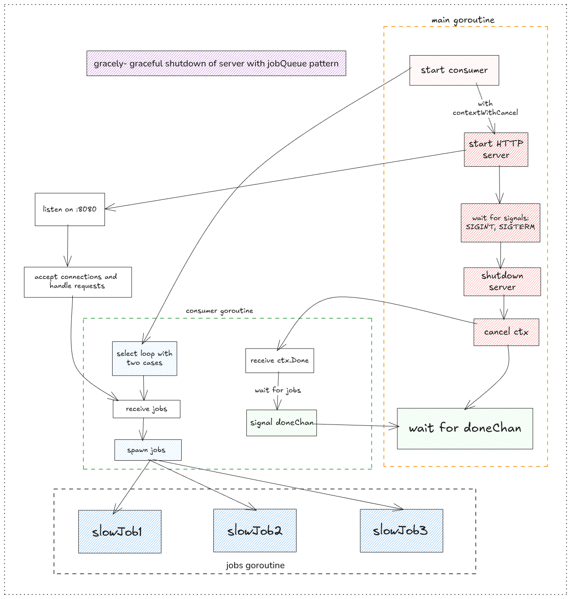

# gracely
> ## a graceful shutdown of server with jobQueue pattern.

Gracefully shutting down server is one good practices at scale to avoid data loss and dropped requests. This tiny implementation gracefully shuts down the server by stopping acceptance of new requests, serving all in-flight requests to completion, signaling when done, and then terminating the server using channels and contexts.

The server accepts HTTP requests, queues jobs for asynchronous processing, and ensures all running jobs complete before shutdown on SIGTERM or SIGINT signals.

## Architecture

